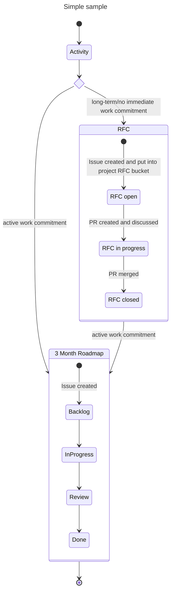

# SIG Extensibility Charter

! DRAFT !

## Scope

 SIG Extensibility focuses on making it easy to build, share, and adopt extensions like [service providers](https://openmcp-project.github.io/docs/about/concepts/service-provider), [cluster providers](https://openmcp-project.github.io/docs/about/concepts/cluster-provider) and [platform services](https://openmcp-project.github.io/docs/about/concepts/platform-service) in the context of [Cloud Orchestrator](https://github.com/openmcp-project).

Topics like provider design, discovery and access management are cross-cutting with [SIG Core]() and will be discussed and assigned to either SIG on a per-topic basis.

### In Scope

- Increase Cloud Orchestrator service options that end users can choose from.
- Developer joy enabled through templates, frameworks and other contributor-focused tooling.
- Explore technical opportunities to simplify and standardize extensibility in Cloud Orchestrator.

### Out of Scope

- Ownership or modification of core APIs, including `ServiceProvider`, `ClusterProvider`, `PlatformService` and `ManagedControlPlane`. SIG Extensibility may propose improvements to these APIs to [SIG Core]() if identified based on the usage in SIG extensibility.
- Platform services that are considered fundamental and required for the majority of Cloud Orchestrator platform instances (e.g. [platform-service-gateway](https://github.com/openmcp-project/platform-service-gateway)) are owned by [SIG Core]().

## Roles and Responsibilities

### SIG Owner

- **Name(s):** Maximilian Techritz (<maximilian.techritz@sap.com>), Christopher Junk (<christopher.junk@sap.com>)
- **Responsibilities:** Organize meetings, maintain charter, communicate with other SIGs, manage roadmap, mentor team members, report to TSC

### SIG Approvers

- **Name(s):** Maximilian Techritz (<maximilian.techritz@sap.com>), Christopher Junk (<christopher.junk@sap.com>)
- **Responsibilities:** Review and approve technical changes, provide mentorship, participate in design discussions, maintain code quality

### SIG Contributors

- **Active Contributors:** [List of contributors]
- **How to join:** Demonstrate consistent contributions to the SIG's areas

## Subprojects

| Subproject | Owner | Description |
|---|---|---|
| [service-provider-crossplane](https://github.com/openmcp-project/service-provider-crossplane) | Maximilian Techritz | Manages the lifecycle of Crossplane and Crossplane providers |
| [service-provider-landscaper](https://github.com/openmcp-project/service-provider-landscaper) | Robert Graeff | Manages the lifecycle of Landscaper instances |
| [cluster-provider-gardener](https://github.com/openmcp-project/cluster-provider-gardener) | Johannes Aubert | Use [Gardener](https://gardener.cloud/) to provision clusters in Cloud Orchestrator |
| [cluster-provider-kind](https://github.com/openmcp-project/cluster-provider-kind) | Maximilian Techritz | Use [kind](https://kind.sigs.k8s.io/) to provision clusters in Cloud Orchestrator |
| [service-provider-template](https://github.com/openmcp-project/service-provider-template) | Christopher Junk | Template for building openMCP service providers |
| [openmcp-testing](https://github.com/openmcp-project/openmcp-testing) | Christopher Junk | Helps to set up e2e test suites for openMCP components |

## Roadmap

SIG Extensibility distinguishes between short-term and long-term activities.

Short-term activities have a commitment to be actively worked on within the next three months and are tracked as GitHub issues (see [SIG Extensibility Board](https://github.com/orgs/openmcp-project/projects/15/views/5)).

Long-term activities are captured as PRs in a request for comments format (see [RFC Overview]()). RFCs serve as the primary mechanism for discussing and refining future work. An RFC results in GitHub issues once the PR has been merged and the commitment to implement an RFC has been made.

